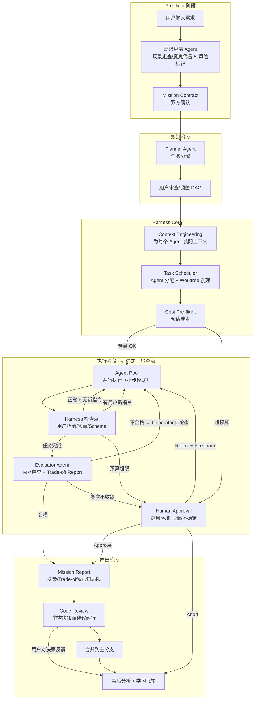

# Swarm 产品深度设计：Harness-Driven Agent Swarm Workbench

> 2026.3.31 Deep Dive — 以 Harness Engineering 为核心的多 Agent 蜂群工作台
> 最后更新：2026.3.31（整合全部产品讨论）

---

## 一、核心竞争力与差异化

### 1.1 什么不是壁垒（诚实评估）

以下能力正在快速商品化，不构成核心竞争力：

| 能力 | 谁已经在做 | 状态 |
|------|-----------|------|
| 多 Agent 并行执行 | Claude Code Teams (2026.2)、VS Code Agent Sessions (2026.1) | 已是大厂标配 |
| Git worktree 隔离 | Claude Code、Composio、几乎所有 swarm 工具 | 已成通用模式 |
| AI 代码审查 | Anthropic Code Review、Qodo 2.0、BugBot (月处理 200 万+ PR) | 独立产品已成熟 |
| 成本追踪 | Tokenr、AgentCost、OpenClaw | 正在商品化 |
| 任务分解 | Claude Code delegate mode、JetBrains Central | 基本能力 |

### 1.2 真正的行业痛点

2026 年开发者对 AI 编码工具的第一大抱怨不是"AI 写不好代码"，而是：

> **"Code review has become a bottleneck."** —— Anthropic
>
> AI 让代码产出增加了 200%，但开发者花在审查 AI 代码上的时间比省下来的还多。AI 代码"看起来正确，编译通过，测试也过了"，但藏着架构问题和行为 bug。

第二大抱怨：

> **"Managing the AI itself is exhausting."**
>
> 选模型、配上下文、选模式、处理失控……管理 AI 的开销侵蚀了本该节省的时间。

**总结：用户不缺写代码的 Agent，缺的是"不用盯着就能信任产出"的机制。**

### 1.3 我们的两个差异化亮点

**亮点 1：Harness 质量闭环 + Trade-off 透明化（引擎）**

不是"检查出问题 → 告诉人类"（Qodo/BugBot 在做的），而是：

```
Generator 写代码 → Evaluator 独立审查 → 不合格？
                     ↑           ↓
                     └── Generator 自动修复
                               ↓
                     合格 → 自动通过（附 Trade-off Report）
                     不确定 → 仅此项提交人类审查
```

核心技术挑战：
- **Evaluator 校准**: 怎样让 Evaluator 真正发现问题而不是走过场
- **反馈工程**: 反馈格式如何让 Generator 能精准修复而不是越改越乱
- **收敛控制**: 循环几次后收敛不了怎么办（终止策略）

信任不来自一个分数（"8.5/10"），而来自对 trade-offs 的透明呈现——因为只有真正做了这件事的人才能讲清楚 trade-offs。这通过 Mission Report（见第五章）实现。

**亮点 2：Harness 作为主操控界面（方向盘）**

不只是"看到 Agent 在干嘛"（被动监控），而是"通过 harness 指挥 Agent 怎么干"（主动操控）：

| 被动可视化（监控工具） | 主动操控（指挥系统） |
|----------------------|-------------------|
| 看到 Agent 在做什么 | 实时重定向 Agent 的工作方向 |
| 看到 Evaluator 打了什么分 | **校准 Evaluator 的评判标准** |
| 看到成本花了多少 | 动态调整预算分配 |
| 看到任务 DAG | 拖拽调整编排顺序和依赖 |
| 事后看报表 | 运行中介入决策 |

用户对 trade-off 报告的反馈驱动**学习飞轮**：系统不只是学"什么代码能通过"，而是学"这个用户在什么场景下偏好什么架构决策"。用得越多，Evaluator 越懂你的标准，需要手动审查的就越少。

### 1.4 北极星指标

**Review Reduction Rate（审查减少率）** — 用户因为信任 Harness 而跳过手动审查的代码变更比例。

- 初始值: 0%（用户审查所有产出）
- 随着 Evaluator 校准逐步上升
- 目标: 80%+（只审查 ~20% 的边界情况）
- 当达到 80%+ 时，产品价值不可替代

**核心叙事**: "其他工具让 Agent 写代码更快。我们让 Agent 写出你**敢直接用**的代码。"

---

## 二、产品定位

### 一句话定义

**"一个人的 Agent 军团指挥部"** — 让单个开发者通过可视化的 Harness 控制面板，同时指挥多个 AI Agent 并行开发，获得一个完整团队的产出。

### 目标用户画像

- **独立开发者 / Indie Hacker**: 希望一人做出团队级产出
- **小团队 Tech Lead**: 用 Agent 扩充团队 10 倍产能
- **AI-native 开发者**: 已在使用 Claude Code / Codex / Aider，需要更好的编排和管控

### 产品核心价值主张

1. **并行即力量**: 5-30 个 Agent 同时为你工作，不是 1 对 1 聊天
2. **Harness 即信任**: 质量闭环 + Trade-off 透明化 → 从审查 100% 到只审查异常
3. **操控即掌控**: 不只是看，更是通过 harness 实时指挥和校准
4. **夜间即产出**: 睡前下达任务，醒来查看 PR 和 Mission Report

---

## 三、Harness Engineering 五层架构

```
┌─────────────────────────────────────────────────────────┐
│                    Commander UI Layer                     │
│          （指挥官视图：看板/编辑器/对话/仪表盘）            │
├─────────────────────────────────────────────────────────┤
│                                                          │
│  ┌──────────────────────────────────────────────────┐   │
│  │           Layer 5: Observability & Eval            │   │
│  │   推理链追踪 · 质量评分 · 成本报表 · 失败根因分析     │   │
│  └──────────────────────────────────────────────────┘   │
│                                                          │
│  ┌──────────────────────────────────────────────────┐   │
│  │           Layer 4: Cost Envelope                   │   │
│  │   Per-Agent 预算 · Per-Task 预算 · 智能路由          │   │
│  │   Token 风暴熔断 · 实时成本归因                       │   │
│  └──────────────────────────────────────────────────┘   │
│                                                          │
│  ┌──────────────────────────────────────────────────┐   │
│  │           Layer 3: Verification Engine              │   │
│  │   Schema 校验 · 独立 Evaluator Agent · 测试运行      │   │
│  │   人类审批队列 · Quality Gate · Mission Report       │   │
│  └──────────────────────────────────────────────────┘   │
│                                                          │
│  ┌──────────────────────────────────────────────────┐   │
│  │           Layer 2: Task Orchestration               │   │
│  │   任务分解 · 依赖编排 · Agent 调度 · 并行/串行控制    │   │
│  │   冲突检测 · 上下文传递 · Checkpoint 介入机制         │   │
│  └──────────────────────────────────────────────────┘   │
│                                                          │
│  ┌──────────────────────────────────────────────────┐   │
│  │           Layer 1: Context Engineering              │   │
│  │   代码库索引 · 知识图谱 · 会话记忆 · 精准上下文装配   │   │
│  └──────────────────────────────────────────────────┘   │
│                                                          │
├─────────────────────────────────────────────────────────┤
│                    Agent Pool (Isolated)                  │
│  ┌─────┐ ┌─────┐ ┌─────┐ ┌─────┐ ┌─────┐ ┌─────┐     │
│  │ A-1 │ │ A-2 │ │ A-3 │ │ A-4 │ │ A-5 │ │ A-N │     │
│  │workt│ │workt│ │workt│ │workt│ │workt│ │workt│     │
│  │ree-1│ │ree-2│ │ree-3│ │ree-4│ │ree-5│ │ree-N│     │
│  └─────┘ └─────┘ └─────┘ └─────┘ └─────┘ └─────┘     │
└─────────────────────────────────────────────────────────┘
```

### Layer 1: Context Engineering — Agent 的"感知系统"

**职责**: 确保每个 Agent 在每一步都得到恰好所需的信息。不多，不少。

**核心机制**:
- **代码库索引**: 全量代码的语义索引（AST + 向量嵌入），Agent 可以"搜索"而非"阅读全部"
- **动态上下文装配**: 根据当前任务自动组装相关文件、接口定义、测试用例、已有实现
- **跨 Agent 上下文隔离与共享**: 每个 Agent 看到自己任务相关的上下文 + 公共知识（架构决策、代码规范）
- **上下文预算**: 参考 Vercel 经验——精简上下文比增加上下文更能提升性能。为每个 Agent 设定上下文 token 上限

**Harness 的角色**: Context Engineering 不是让 Agent 自己决定看什么，而是 Harness 为 Agent 精准"投喂"。这消除了 Agent 因信息过载而做出错误决策的风险。

### Layer 2: Task Orchestration — 蜂群的"指挥系统"

**职责**: 将高层任务分解为可并行的子任务，分配给最合适的 Agent，管理依赖和冲突。

**核心机制**:
- **Planner Agent**: 接收用户的高层需求，输出结构化任务列表，包含依赖关系
- **任务队列 (Task Queue)**: SQLite 支持的原子任务队列，防止多个 Agent 抢同一个任务
- **Agent 调度器**: 根据任务类型、复杂度、Agent 能力匹配最优 Agent
- **Git Worktree 隔离**: 每个 Agent 自动创建独立 git worktree + 分支，天然文件隔离
- **依赖编排**: DAG（有向无环图）编排——"A 和 B 并行 → C 等 A+B 完成 → D 和 E 并行"
- **冲突预检**: 分配任务前检测潜在文件冲突，必要时串行化
- **Checkpoint 介入机制**: 见第六章"运行时介入架构"

**编排示例**:
```
用户输入: "为电商平台实现购物车功能"
                  ↓
[Planner Agent] 分解为:
  T1: 购物车数据模型 (backend)      ─────┐
  T2: 购物车 API 接口 (backend)     ─ T1 │
  T3: 购物车 UI 组件 (frontend)     ─────┤
  T4: 加入购物车交互逻辑 (frontend) ─ T2,T3
  T5: 购物车单元测试 (test)         ─ T1,T2
  T6: 购物车 E2E 测试 (test)        ─ T4
                  ↓
[Scheduler] 分配:
  Agent-1 → T1 (worktree-1)
  Agent-2 → T3 (worktree-2)   ← T1,T3 并行
  等 T1 完成 → Agent-3 → T2 (worktree-3)
  等 T1 完成 → Agent-4 → T5 (worktree-4)
  等 T2,T3 完成 → Agent-2 → T4 (复用)
  等 T4 完成 → Agent-5 → T6 (worktree-5)
```

### Layer 3: Verification Engine — 质量的"免疫系统"

**职责**: 确保每个 Agent 的每一步产出都经过独立验证，不放过任何质量问题。

**三级验证体系**:

```
Level 1: Schema 校验（每步自动执行，50-150ms）
  - 工具调用返回值格式正确？
  - 文件修改符合预期结构？
  - 编译/类型检查通过？

Level 2: Evaluator Agent 审查（每个任务完成时）
  - 独立 Agent 审查代码质量（Anthropic Generator/Evaluator 分离原则）
  - 对照 Mission Contract（见第四章）逐项验证
  - 运行测试套件
  - 生成 Trade-off Report（见第五章）
  - 关键: Evaluator 与 Generator 是不同的 Agent 实例，避免"自评偏乐观"

Level 3: 人类审批（按配置触发）
  - 高风险操作（删除文件、修改核心模块、执行系统命令）
  - 质量分低于阈值时
  - 成本超预期时
  - 支持批量审批（一次审批多个 Agent 的操作）
```

**质量标准可定制化**（受 Anthropic 设计启发）:
- 用户可定义评估维度（如：功能完整性、代码可读性、测试覆盖率、安全性）
- 每个维度可设权重和阈值
- 用 few-shot 例子校准 Evaluator 的判断标准
- 质量标准随项目积累持续优化

### Layer 4: Cost Envelope — 预算的"保险丝"

**职责**: 防止 token 风暴和成本失控，同时作为异常行为的早期预警信号。

**核心机制**:
- **Per-Task 预算天花板**: 每个任务基于复杂度预估设定 token 预算。超出 3x 中位数立即熔断
- **Per-Agent 预算**: 每个 Agent 有独立的运行预算，防止单个 Agent 失控
- **全局预算**: 整个 Swarm 运行的总预算上限（对应"夜间模式"场景——睡前设置总预算）
- **智能模型路由**: 简单任务路由到快速/便宜模型；复杂任务用强模型
- **Pre-flight 成本预估**: 任务执行前先用轻量模型预估成本，超出预期则请求人类确认
- **成本异常 = 故障信号**: 触发成本天花板的任务自动标记为"可能存在问题"，引导人类检查

**真实案例参考**:
- 有开发者的 Agent 因 API 错误陷入重试循环，一个周末消耗 $47,000
- Anthropic 的 6 小时 harness 运行花费 $200，4 小时 DAW 构建花费 $124

### Layer 5: Observability & Evaluation — 指挥官的"战场态势图"

**职责**: 让用户对所有 Agent 的活动有完整的可见性，支持实时监控和事后分析。

**实时可观测**:
- **Agent 活动流**: 每个 Agent 当前在做什么
- **推理链路视图**: 点击任何 Agent 行为，看到完整推理过程
- **成本仪表盘**: 实时 token 消耗，按 Agent / 任务 / 模型 归因
- **质量仪表盘**: 各任务的 Evaluator 评分、通过/失败状态、趋势图

**事后分析**:
- **运行回放**: 完整重播一次 Swarm 运行的全过程
- **失败根因分析**: 自动追溯失败任务的根因
- **Agent 绩效比较**: 对比不同 Agent 配置在同类任务上的表现
- **改进建议**: 基于历史数据，建议哪些 harness 参数应该调整

---

## 四、Pre-flight 需求澄清与 Mission Contract

### 4.1 为什么需要 Pre-flight 澄清

"离屏长任务"场景有一个核心矛盾：高明确度 spec 才能驱动可靠的长时间执行，但人类天然给不出高明确度 spec——下达复杂任务时总会遗漏细节和场景。

经济学上：离屏前多花 5 分钟澄清需求（~$0.10）vs. Agent 理解错方向跑 4 小时（~$50 作废）。Pre-flight 需求澄清不是可选功能，是离屏长任务场景的**必要条件**。

### 4.2 三种澄清模式

**模式 1: 场景走查（Scenario Walk）**

Agent 走用户流程，在每个分叉点暂停追问：

```
Agent: 我理顺一下流程。用户到注册页 → 填表 → 提交。
       提交后发生什么？
       A) 直接激活  B) 验证邮件  C) 人工审核

User:  B

Agent: 用户没收到邮件怎么办？需要"重发"功能吗？

User:  要

Agent: 验证链接过期时间多久？
       过期后是重定向到"重发"页面还是显示错误？
```

用户不需要想到所有边界情况，Agent 通过走流程帮他逼出来。

**模式 2: 魔鬼代言人（Devil's Advocate）**

Agent 故意找 spec 漏洞：

```
Agent: 你说"用户认证"，但我注意到几个你没提到的点：

       1. 多设备同时登录：允许？还是新登录踢掉旧的？
       2. 密码策略：只要求长度？还是大小写+数字+特殊字符？
       3. 暴力破解防护：登录失败 N 次锁定？N 是多少？
       4. 你的项目已有 User model，扩展还是新建？

       请告诉我你的选择，或者说"你决定"让我自行判断。
```

关键设计：给用户"你决定"的选项——不是所有细节用户都关心。

**模式 3: 风险标记（Risk Highlighter）**

只追问"搞错了代价最大"的点：

```
Agent: 这个任务中，风险最高的两个点：

       1. 密码重置邮件 — 依赖外部 SMTP。你配了吗？还是先 mock？
       2. JWT 密钥管理 — 需要环境变量。你有 .env 机制吗？

       其他部分我有足够信心独立完成。
```

最不打扰用户。

### 4.3 澄清深度随离屏时长自动调节

```
离屏时长预估            → 澄清深度
────────────────────────────────────────────
< 15 分钟（在线看着）    → 不做澄清，直接开始
15-60 分钟（离开一会）   → 风险标记（只问高风险点）
1-6 小时（夜间模式）     → 场景走查 + 魔鬼代言人（全面澄清）
```

### 4.4 Mission Contract（任务合同）

澄清循环的终产物——双方签字画押的合同，是整个后续流程的"宪法"：

```
Mission Contract: 用户认证系统
━━━━━━━━━━━━━━━━━━━━━━━━━━━━━━━

【用户明确要求的】（不能自由发挥）
  - 注册后发验证邮件，点链接激活
  - JWT 鉴权，access token 15min + refresh token 7d
  - 允许多设备同时登录
  - 密码重置走邮件链接，1h 过期

【用户说"你决定"的】（Agent 自主决策，记入 Trade-off Report）
  - 密码策略的具体规则
  - 登录失败锁定策略
  - 错误消息的具体措辞

【明确不做的】（防止 scope creep）
  - OAuth 第三方登录
  - 双因素认证
  - 用户角色/权限体系

【已确认的环境前提】
  - SMTP 已配置（SendGrid，密钥在 .env）
  - 已有 User model，扩展而非新建
  - 前端用 React，后端 Express

预算上限: $30 | 质量门槛: Evaluator ≥ 7/10 | 最大时长: 4 小时
```

**Mission Contract 的意义**:
1. 是 Agent 工作的**宪法**——所有决策都要在这个框架内
2. 是 Evaluator 的**评判依据**——"用户明确要求的"必须做到，"明确不做的"不能碰
3. 是 Trade-off Report 的**参照系**——Report 里的每个 trade-off 都可以追溯到 Contract
4. 是用户醒来后的**第一份阅读材料**——先看 Contract 确认方向对不对

---

## 五、Mission Report 与 Trade-off 透明化

### 5.1 核心理念

> 提出概念和技术思路是 cheap 的，实际落实过程中总是伴随各种 trade-offs。能讲清楚各种 trade-offs 是体现真正参与工作的最重要依据。

信任不来自一个分数（"8.5/10"），而来自对 trade-offs 的透明呈现。Mission Report 让用户审查**决策**而非**代码行**。

### 5.2 Mission Report 结构

```
Mission Report: 用户认证系统
━━━━━━━━━━━━━━━━━━━━━━━━━━━━━━━━

【架构决策与 Trade-offs】

决策 1: 鉴权方案 — 选择 JWT (stateless) 而非 Session (stateful)
  选择理由: 无状态设计，水平扩展零成本，无需 Redis 等会话存储
  付出代价: Token 签发后无法立即撤销
  遗留风险: 如需"强制下线"功能，需额外实现 Token 黑名单
  ⚠ 建议: 当前可接受。若上线后需账户冻结能力，优先补这一块

决策 2: 密码哈希 — 选择 bcrypt (cost=12) 而非 argon2id
  选择理由: 生态成熟，无 native 编译依赖，部署简单
  付出代价: 同等安全等级下比 argon2 慢约 40%
  遗留风险: 无，bcrypt cost=12 在 2026 年仍属安全参数
  📝 备注: 考虑过 argon2id 但 node-argon2 在 Alpine Linux 上有构建问题

决策 3: 密码重置 — 选择邮件链接而非验证码
  选择理由: 用户体验更流畅，无需手动输入
  付出代价: 依赖邮件送达率，链接可能被邮件客户端预取而失效
  缓解措施: 链接有效期 1h + 一次性使用 + 防预取 token 机制

【Evaluator 审查摘要】

第一轮审查发现:
  ❌ 注册接口返回了 password_hash（安全问题，已自动修复）
  ❌ JWT 过期时间硬编码 24h（灵活性问题，已自动修复为可配置）
  ⚠️ 密码强度校验仅检查长度，未检查常见密码（标记为建议项）

修复后二轮审查: 全部通过

【已知局限 — 诚实地说没做什么】

  - 未实现请求频率限制（上线前建议补充）
  - 未实现 CSRF 防护（如果前端是服务端渲染则需要）
  - 未做负载测试（不清楚 bcrypt cost=12 在高并发下的吞吐表现）
  - OAuth 第三方登录不在本次范围内（Contract 已明确排除）

【成本与资源】

  执行时间: 8m42s | Token 消耗: 48,200 | 成本: $3.85
  Agent 调用模型: Claude Sonnet 4 (T1-T4), Claude Haiku 4 (T5-T6)
```

### 5.3 Report 如何改变用户的工作

用户拿到 Report 后，不是逐行读代码，而是：

1. 看"架构决策"——这三个 trade-off 我是否同意？（30 秒判断）
2. 看"已知局限"——这些遗留项我能否接受？（30 秒判断）
3. 看"Evaluator 审查摘要"——自动修了什么，标记了什么？（30 秒扫一眼）

**总审查时间：2 分钟，审查的是决策而不是代码。**

只有当某个决策用户不同意时（比如"我不要 JWT，我要 Session"），才需要深入看代码或给 Agent 新指令。

### 5.4 Report 驱动学习飞轮

用户对 Report 的反馈是比"通过/拒绝"丰富得多的学习信号：

- "通过/拒绝"只告诉系统代码好不好
- "我不同意决策 1，这个场景应该用 Session"告诉系统**用户的技术偏好和判断逻辑**

系统不只学"什么代码能通过"，还学"这个用户在什么场景下偏好什么架构决策"。飞轮转速更快。

---

## 六、运行时介入与 Checkpoint 架构

### 6.1 问题

Cursor 等现有产品中，在 Agent 工作时输入新 prompt 只会进入 queue 排队，不能真正介入运行中的 workflow。我们需要实现真正的运行时介入。

### 6.2 核心设计：步进式执行 + Harness 检查点

Agent 不是"扔进去不管"的黑盒，而是被 Harness 包裹的步进式执行器。每次工具调用之间都有一个检查点：

```
Agent 循环:

  Think → [LLM生成] → 得到结果
                         ↓
                   ┌─── Harness 检查点 ───┐
                   │                       │
                   │  ✓ 检查用户指令队列    │
                   │  ✓ 检查预算是否超限    │
                   │  ✓ 检查任务是否被取消  │
                   │  ✓ Schema 验证结果     │
                   │                       │
                   └───────────────────────┘
                         ↓
            有新指令？──→ 注入到下一步的上下文
            被取消？──→ 安全终止，回滚 worktree
            一切正常？──→ 执行工具调用 → 下一步 Think
```

**关键：Agent 以小步模式运行（每次一个工具调用），Harness 在步间自然介入。不需要打断 LLM 生成。**

### 6.3 三个层次的介入手段

**层次 1: 任务级介入（容易，不打断 Agent）**

操作的是 DAG 中还没开始的任务：
- 取消排队中的任务
- 插入新任务
- 调换优先级
- 给排队中的任务追加约束

完全不影响正在运行的 Agent。

**层次 2: Agent 步间注入（中等难度，核心设计）**

三种注入方式，按侵入性递增：

**(A) 便签条注入（Breadcrumb）**：不打断 Agent，在下一步上下文中插入信息：
```
[System Note - Priority Update from Commander]:
用户补充要求：API 响应格式统一使用 { code, data, message } 结构。
请在后续实现中遵循此约束。
```
Agent 下一步 Think 时自然看到。**零额外 token 浪费，无需重启。**

**(B) 黄灯暂停（Yield & Redirect）**：Agent 完成当前步骤后暂停，接收新指令，从新上下文恢复。**丢失当前 LLM 调用剩余生成，但已完成的文件修改保留。**

**(C) 红灯重启（Kill & Respawn）**：终止 Agent，worktree 保留为 checkpoint，用新指令启动新 Agent 接手。Harness 自动生成"接手摘要"。**成本最高，但方向完全可控。**

**层次 3: 分叉替代打断（Fork, Don't Interrupt）**

与其打断一个正在跑的 Agent，不如分叉一个新的：
```
Agent-2 正在用 REST 实现 API（你觉得应该用 GraphQL）

让 Agent-2 继续 → 同时启动 Agent-2' 用 GraphQL 做
→ 两个都完成后对比 → 选一个合并
```
不需要打断任何东西，自然复用"竞赛模式"。

### 6.4 实现优先级

| 介入方式 | 技术难度 | 用户价值 | MVP 建议 |
|---------|---------|---------|---------|
| 操作未开始的任务（DAG 编辑） | 低 | 高 | Phase 1 |
| 便签条注入（Breadcrumb） | 低-中 | 高 | Phase 1 |
| 黄灯暂停 + 重定向 | 中 | 中-高 | Phase 2 |
| 红灯终止 + 重启 | 中 | 中 | Phase 2 |
| 分叉对比 | 中 | 高 | Phase 2（复用竞赛模式） |
| LLM 生成中打断 | 高 | 低 | 不做（变通方案够用） |

**核心设计原则：不试图"打断"Agent，而是在 Agent 循环中植入足够多的检查点，让 Harness 在步间自然介入。这必须是 Agent 执行引擎的核心设计，不是事后能轻松补上的。**

---

## 七、Commander UI 设计概念

### 主界面布局

```
┌─────────────────────────────────────────────────────────────┐
│ [Logo] Swarm                   [Cost: $3.42] [Agents: 5/8]  │
├────────────┬────────────────────────────────────────────────┤
│            │                                                 │
│  Mission   │              Main Panel                         │
│  Board     │  ┌──────────────────────────────────────────┐  │
│            │  │                                           │  │
│  ▸ Sprint 1│  │   (根据左侧选择切换内容)                   │  │
│    ✓ T1    │  │                                           │  │
│    ◉ T2    │  │   - Task DAG 视图                          │  │
│    ◉ T3    │  │   - Agent 活动实时流                       │  │
│    ○ T4    │  │   - 代码 Diff 审查                         │  │
│    ○ T5    │  │   - 对话/指令面板                          │  │
│            │  │   - 成本/质量仪表盘                         │  │
│  ▸ Sprint 2│  │   - Mission Report                         │  │
│    ...     │  └──────────────────────────────────────────┘  │
│            │                                                 │
│  ──────── │  ┌──────────────────────────────────────────┐  │
│  Agents    │  │          Approval Queue                    │  │
│  A-1 ◉ T2 │  │  [Approve All] [Reject All]               │  │
│  A-2 ◉ T3 │  │  ⚡ A-1 wants to: delete user_old.py      │  │
│  A-3 idle  │  │  ⚡ A-2 wants to: run npm install          │  │
│  A-4 idle  │  │  ⚡ A-3 wants to: modify auth.rs           │  │
│            │  └──────────────────────────────────────────┘  │
└────────────┴────────────────────────────────────────────────┘
```

### 六个核心视图

**1. Task DAG 视图（编排全景）**
- 可视化任务依赖图，节点颜色表示状态（灰=待执行, 蓝=进行中, 绿=完成, 红=失败）
- 每个节点显示分配的 Agent、已用 token、Evaluator 评分
- **可拖拽重新编排、添加/删除依赖（运行时介入层次 1）**
- 右键节点：查看详情 / 重新分配 Agent / 手动标记完成 / 中止

**2. Agent 活动实时流（作战态势）**
- 类似终端多窗格，每个窗格是一个 Agent 的实时活动
- 显示 Agent 正在编辑的文件、执行的命令、推理过程
- **点击任何 Agent 可以发送便签条指令（运行时介入层次 2A）**
- 可以"Follow"一个 Agent，主面板自动跟踪它打开的文件
- Agent 状态灯：🟢 正常运行 / 🟡 等待审批 / 🔴 已暂停 / ⬜ 空闲

**3. Code Review 面板（质量检查）**
- 所有 Agent 的代码变更汇聚到统一 Review 界面
- 类似 GitHub PR 的 diff 视图，增强了：
  - Evaluator Agent 的自动评审意见
  - 每个 diff hunk 可以单独 Approve / Reject / Request Revision
  - 点击"Request Revision"自动将反馈发回给 Agent
- 支持批量操作：一次 Approve 多个 Agent 的变更

**4. 对话/指令面板（指挥通道）**
- 向单个 Agent 或全体 Agent 发送指令
- 高层指令广播给所有活跃 Agent
- 与特定 Agent 对话
- 发起新 Mission 的入口
- **也是 Pre-flight 需求澄清的交互界面**

**5. Harness 仪表盘（数据中心）**
- 成本面板: 实时 token 消耗曲线、按 Agent/任务/模型 归因、预算剩余
- 质量面板: Evaluator 评分分布、通过率趋势、常见失败类型
- 效率面板: 任务平均完成时间、Agent 利用率、并行度
- 异常面板: 成本异常、质量异常、超时任务

**6. Mission Report 视图（成果档案）**
- 展示完整的 Mission Report（架构决策、trade-offs、已知局限）
- 用户可以对每个决策点标记"同意"/"不同意"，反馈进入学习飞轮
- 与 Mission Contract 对照展示，便于检查方向是否偏离

---

## 八、关键用户流程

### Flow 1: 日间模式（交互式指挥）

```
1. 用户在指令面板输入: "实现用户认证系统，包括注册、登录、JWT 鉴权、密码重置"
2. 【Pre-flight 澄清】Agent 与用户进行需求明确对话（风险标记模式）
3. 生成 Mission Contract，用户确认
4. Planner Agent 生成任务 DAG，展示在 Task DAG 视图
5. 用户审查 DAG，调整优先级/依赖
6. 用户确认后，Scheduler 自动分配 Agent 并启动
7. 用户在 Agent 活动流中观察各 Agent 工作
8. 用户随时可通过便签条注入补充指令（运行时介入）
9. Approval Queue 弹出需要审批的操作，用户逐个或批量审批
10. Agent 完成后，Evaluator 自动审查 + 生成 Trade-off Report
11. 不合格的自动反馈给 Generator 修复（闭环）
12. 用户在 Mission Report 视图审查决策，而非逐行看代码
13. 所有任务通过后，用户一键合并所有 Agent 分支到主分支
```

### Flow 2: 夜间模式（无人值守）

```
1. 用户在睡前发起任务
2. 【Pre-flight 澄清】Agent 与用户进行全面需求明确（场景走查 + 魔鬼代言人）
3. 生成 Mission Contract，用户确认
4. 用户配置:
   - 预算上限: $50
   - 质量门槛: Evaluator 评分 > 7/10
   - 风险策略: 高风险操作跳过（不删文件、不修改核心模块）
   - Agent 数量: 5 个并行
5. Swarm 在夜间自动执行:
   - Planner 分解每个 issue 为任务
   - Agent 并行工作，每个在独立 worktree
   - Generator ↔ Evaluator 闭环自动修复
   - 质量不达标且闭环收敛不了的暂停（终止策略）
   - 成本到达预算 80% 时停止接新任务
   - 每个完成的任务自动创建 PR
6. 早上用户查看:
   - 先读 Mission Contract 确认方向对不对
   - 再读 Mission Report 确认 trade-offs 是否可接受
   - 仪表盘: 5 个 issue 中 4 个完成，1 个暂停
   - 4 个 PR 等待 review
   - 总成本 $32，详细归因可查
   - 失败的 issue 有完整的失败分析报告
```

### Flow 3: 竞赛模式（Best-of-N）

```
1. 用户面对复杂决策: "搜索用 Elasticsearch 还是 PostgreSQL FTS?"
2. 选择"竞赛模式"，两个 Agent 各做一个方案
3. Agent-1 在 worktree-1 实现 ES 方案
4. Agent-2 在 worktree-2 实现 PG FTS 方案
5. 两个 Agent 完成后，Evaluator 对比评估
6. 生成对比 Mission Report（含各方案的 trade-offs）
7. 用户查看报告 + 实际代码，做最终决策
8. 选中方案合并到主分支，另一个归档
```

---

## 九、Harness 全生命周期流程图



**完整信任链**: Contract 约束方向 → Checkpoint 保障过程 → Report 呈现结果 → 用户反馈驱动改进

---

## 十、与现有产品的差异化对比

| 维度 | Cursor/Windsurf | CodeAgentSwarm | Composio Orchestrator | **Our Swarm** |
|------|----------------|----------------|----------------------|---------------|
| Agent 数量 | 1 个（串行对话） | 最多 6 个终端 | 无上限（CLI） | 5-30 个（可视化） |
| Pre-flight 澄清 | 无 | 无 | 无 | **需求澄清 Agent + Mission Contract** |
| Harness 层 | 无 | 基本 guardrails | 基本 lifecycle | **五层完整 harness** |
| 质量闭环 | 无独立评估 | 无 | CI 驱动 | **Generator ↔ Evaluator 自修复循环** |
| Trade-off 透明化 | 无 | 无 | 无 | **Mission Report 呈现全部决策和 trade-offs** |
| 运行时介入 | 排队等下一轮 | 无 | 无 | **检查点架构 + 便签条/暂停/分叉** |
| 成本管控 | 无 | 无 | 无 | **Per-Agent/Task/Global 预算** |
| 可观测性 | Token 计数 | 终端输出 | JSONL 日志 | **推理链追踪 + 仪表盘** |
| 任务编排 | 手动 | 任务板 | Issue 驱动 | **DAG 可视化编排** |
| 用户审查对象 | 代码行 | 终端输出 | PR diff | **决策和 trade-offs** |
| 夜间模式 | 无 | 有（基础） | 有 | **有（Contract + 预算 + 质量门控）** |
| 竞赛模式 | 无 | 无 | 无 | **Best-of-N 方案对比** |
| 学习飞轮 | 无 | 无 | 无 | **用户对决策反馈校准 Evaluator** |
| 产品形态 | 桌面 IDE | Web 面板 | CLI + Web | **桌面客户端（Tauri）** |

---

## 十一、Demo 场景设计

### 核心叙事

> "其他工具让 Agent 写代码更快。我们让 Agent 写出你敢直接用的代码。"

### Demo 剧本："从一句话到可信赖的 PR，10 分钟"

前置设定: 一个已有基础框架的项目（不是空项目，更真实）。

**第一幕：需求澄清 + 合同确认（1.5 分钟）**

用户输入："为这个项目添加用户认证功能：注册、登录、JWT 鉴权、密码重置邮件"

需求澄清 Agent 自动启动（风险标记模式）：
```
Agent: 我注意到两个高风险点需要你确认：
       1. 密码重置邮件依赖 SMTP。你配了 SendGrid 吗？还是先 mock？
       2. 你的项目已有 User model，我应该扩展它还是新建？
       其他你没提到的细节（密码策略、登录锁定等）由我自行判断，可以吗？
```
用户快速回答 → 生成 Mission Contract → 用户确认 → Planner 输出 DAG。

**观众感受**: "它在开始前就问到了我会漏掉的点。"

**第二幕：蜂群启动，Harness 介入（5 分钟）**

4 个 Agent 同时启动，屏幕上看到四列实时活动流。DAG 节点变蓝。

**Wow Moment 1 —— Evaluator 抓真 bug，闭环自修复**:

Agent-2 完成注册 API → Evaluator 自动审查 → 发现安全问题：

> ⚠️ 注册接口在返回体中包含了 password_hash。已反馈给 Agent-2。

Agent-2 收到反馈 → 修改 → 重新提交 → Evaluator 重审 → ✅ Passed (8.5/10)

**全程无人类介入。这是 demo 的核心记忆点。**

**Wow Moment 2 —— 成本异常即故障信号**:

Agent-4 的 token 消耗曲线突然飙升（仪表盘实时可见）。Harness 标记异常：

> ⚠️ Agent-4 成本超出同类任务中位数 3x，疑似循环。已暂停。

用户点击查看 → 发送便签条指令："用 Express middleware 的标准模式" → Agent-4 恢复正常。

**Wow Moment 3 —— DAG 依赖自动编排**:

T1 完成 → T2、T3、T5 自动启动（DAG 节点依次变蓝）→ T6 灰着等所有上游完成。无需人操作。

**第三幕：审查决策，而非代码（2 分钟）**

所有任务完成。Mission Report 视图打开：

```
Review Summary:
  T1: User Model         ✅ Auto-approved (9/10)
  T2: Register API       ✅ Auto-approved (8.5/10)  [已自修复 1 个安全问题]
  T3: Login + JWT        ✅ Auto-approved (8/10)
  T4: Auth Middleware     ⚡ Needs Review (6.5/10)
  T5: Password Reset     ✅ Auto-approved (8/10)
  T6: Integration Tests  ✅ Auto-approved (9/10)

  6 个任务中，5 个自动通过，1 个需要你审查
```

用户看 Mission Report 的架构决策 → 3 个 trade-off 都合理 → 只细看 T4 → Evaluator 标注："JWT 过期时间硬编码，建议改为可配置" → 用户点 Request Revision → Agent 修改 → 通过。

用户点 **"Merge All"**。

**观众感受**: "6 个任务我只看了 1 个，而且看的是决策不是代码。"

**第四幕：成果总结（30 秒）**

```
Mission: 用户认证系统
━━━━━━━━━━━━━━━━━━━━━━━━━━━
✅ 完成   6/6 任务
⏱  耗时   8 分 42 秒
💰 成本   $3.85
📊 质量   平均 8.2/10
👀 人工审查  1/6 任务（17%）
🔄 自修复   2 个问题（Evaluator 自动闭环）
━━━━━━━━━━━━━━━━━━━━━━━━━━━
预估手动开发: 4-6 小时
```

**收尾**: "8 分钟，$3.85，你只审查了 17% 的代码——不是因为偷懒，是因为 Harness 替你审查了其余 83%，并且告诉你每一个决策为什么这么做。"

---

## 十二、技术栈初步映射

基于前端框架选型调研的结论：

| 层次 | 技术选型 | 理由 |
|------|---------|------|
| 桌面框架 | Tauri 2.0 | 性能优先，Rust 后端天然匹配 Agent 基础设施 |
| 前端 | 待定（React/Solid） | 需要丰富的 UI 组件生态 |
| 代码编辑 | Monaco Editor | VS Code 同款，满足 Code Review 需求 |
| Agent 运行时 | Rust 进程管理 | 每个 Agent 是独立进程/子进程 |
| Git 操作 | libgit2 (Rust binding) | 程序化 worktree 管理 |
| 任务队列 | SQLite | 本地优先，原子操作，简单可靠 |
| 知识存储 | SQLite + 向量索引 | 代码库语义检索 |
| LLM 接口 | 多供应商适配层 | 支持 Anthropic/OpenAI/Google/Ollama |
| 可观测性 | 结构化 JSONL 日志 + 内置分析 | 本地优先，不依赖外部服务 |

---

## 十三、MVP 范围与阶段划分

### Harness 五层的构建优先级

```
关键路径（按依赖顺序）:

1. Tool Layer（工具层）         ← 地基。Agent 没有工具什么都做不了
2. Context Layer（上下文层）    ← 骨架。没有它多 Agent 会互相踩踏
3. Permission Layer（权限层）   ← 安全网。没有它 Agent 可能造成破坏
4. Trace Layer（追踪层）        ← 眼睛。没有它看不到 Agent 在干嘛
5. Knowledge Layer（知识层）    ← 大脑。提升 Agent 做对事的概率

Evaluator 需要 1-4 都就位才能工作。
```

### Phase 1: 核心循环验证（4-6 周）

目标: 验证"一人指挥多 Agent 并行开发 + Evaluator 闭环"的核心体验。

**必须有**:
- [ ] 对话面板: 输入需求，Planner 分解任务
- [ ] 2-3 个 Agent 并行执行（git worktree 隔离）
- [ ] 步进式 Agent 执行引擎 + Harness 检查点（核心架构，必须从第一天就有）
- [ ] 基础 Schema 验证（编译检查/类型检查）
- [ ] Agent 活动实时流（看到每个 Agent 在做什么）
- [ ] 统一 Code Diff 审查
- [ ] Per-Task 成本追踪（实时显示 token 消耗）
- [ ] 便签条注入（基础运行时介入）
- [ ] 基础 DAG 编辑（任务级介入——取消/插入排队中的任务）

**不需要**:
- ~~Pre-flight 需求澄清~~（先用自由文本输入）
- ~~Mission Contract~~
- ~~独立 Evaluator Agent~~（先用 Schema 验证）
- ~~Mission Report~~
- ~~DAG 可视化编排~~（先用文本/列表展示）
- ~~夜间模式~~（先做交互式）
- ~~竞赛模式~~
- ~~知识图谱~~
- ~~学习飞轮~~

### Phase 2: Harness 深化 + 核心差异化（4-6 周）

目标: 实现两个差异化亮点的核心能力。

- [ ] 独立 Evaluator Agent + Generator ↔ Evaluator 闭环
- [ ] 可定制质量标准（维度、权重、阈值、few-shot 校准）
- [ ] Mission Report（Trade-off 透明化）
- [ ] Pre-flight 需求澄清 Agent（风险标记模式先行）
- [ ] Mission Contract 生成
- [ ] 成本预算系统（Per-Agent + Per-Task + Global）
- [ ] 智能模型路由
- [ ] DAG 可视化编排
- [ ] 推理链路追踪
- [ ] 黄灯暂停 + 红灯重启（高级运行时介入）

### Phase 3: 自治能力 + 飞轮（4-6 周）

目标: 实现无人值守场景 + 学习飞轮。

- [ ] 夜间模式（Contract + 预算 + 质量门控）
- [ ] 完整 Pre-flight 澄清（场景走查 + 魔鬼代言人）
- [ ] 竞赛模式 (Best-of-N) + 分叉对比
- [ ] 学习飞轮（用户对决策反馈 → 校准 Evaluator）
- [ ] 知识积累和跨会话记忆
- [ ] Agent 绩效分析和改进建议
- [ ] 运行回放

---

## 十四、参考资料

- Anthropic: [Harness design for long-running application development](https://www.anthropic.com/engineering/harness-design-long-running-apps) (2026.3.24) — 三 Agent 架构 (Planner/Generator/Evaluator)
- [What Is Harness Engineering?](https://harness-engineering.ai/blog/what-is-harness-engineering/) — Harness 五核心组件，"模型决定 10-15%，harness 决定 80%"
- [Improving Deep Agents with Harness Engineering](https://blog.langchain.dev/improving-deep-agents-with-harness-engineering/) — LangChain 通过 harness 改进将完成率从 52.8% 提到 66.5%
- [AI Coding Agents Haven't Made Us Faster](https://sganley27.medium.com/ai-coding-agents-havent-made-us-faster) — 代码审查瓶颈分析
- [AI Coding Agents Have a UX Problem](https://speedscale.com/blog/ai-coding-agents-ux-problem/) — "管理 AI 本身"的开销侵蚀生产力
- [35-Agent Coding Swarm](https://dev.to/mdostal/i-built-a-35-agent-ai-coding-swarm-that-runs-overnight-440) — 多 Agent 并行处理 ticket 的实践验证
- [Composio Agent Orchestrator](https://github.com/ComposioHQ/agent-orchestrator) — 8 插件槽位的 Agent 编排架构参考
- [Multi-Model AI Code Review](https://zylos.ai/research/2026-03-01-multi-model-ai-code-review-convergence) — Actor-Critic 模式、并行 ensemble 投票
