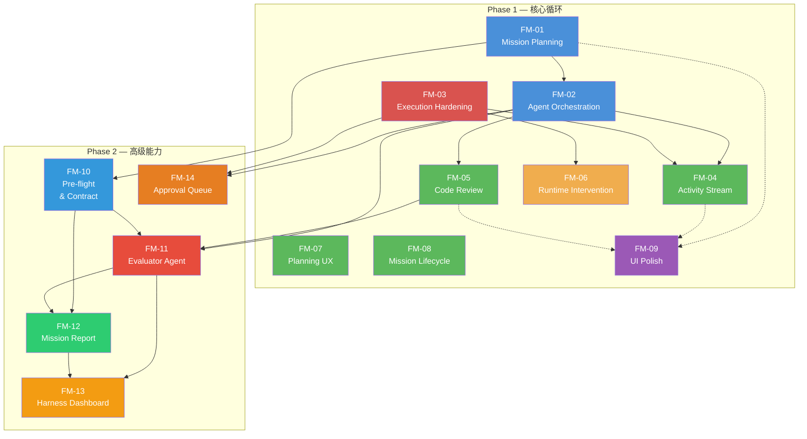

# Miragenty 功能模块总览

> 版本: v2.0 | 日期: 2026-04-08  
> 范围: Phase 1（核心循环 + UI 对齐）+ Phase 2（高级能力）  
> 基于: swarm-product-deep-dive.md + design/prototypes/ + phase2-prototype-backlog.md

---

## 一、全量模块清单

### Phase 1（核心循环验证 + UI 对齐）

| 模块 ID | 名称 | 状态 | 核心职责 |
|---------|------|:---:|------|
| FM-01 | Mission Planning & Task DAG | ✅ DONE | 用户输入需求 → Planner 分解任务 → DAG 展示与编辑 |
| FM-02 | Multi-Agent Orchestration | ✅ DONE | Agent 调度器 + Git worktree 隔离 + 并行执行 |
| FM-03 | Execution Engine Hardening | ✅ DONE | Checkpoint 持久化 + Schema 验证 + Agent 取消 |
| FM-04 | Activity Stream & Cost Tracking | ✅ DONE | 活动流 UI 增强 + 实时成本追踪与展示 |
| FM-05 | Code Review & Diff | ✅ DONE | Monaco Editor 集成 + Worktree Diff 审查界面 |
| FM-06 | Runtime Intervention | ✅ DONE | 便签条注入 + Checkpoint 暂停/恢复机制 |
| FM-07 | Planning UX Enhancements | ✅ DONE | DAG 画布缩放/平移/适配 + Planner 流式输出 |
| FM-08 | Mission Lifecycle | ✅ DONE | 历史 Mission 删除 + 停止 + 重新执行 |
| FM-09 | UI Polish — 原型设计对齐 | 📋 PLANNED | TopBar 指标、Grid 模式、终端风格、DAG 拖拽/详情面板、Sidebar Agent 列表、Command Palette、Review 增强、Settings 可编辑 |

### Phase 2（高级能力）

| 模块 ID | 名称 | 状态 | 核心职责 |
|---------|------|:---:|------|
| FM-10 | Pre-flight & Mission Contract | 📋 PLANNED | 多轮对话式需求澄清 + 结构化 Contract 构建 + Contract 感知的 DAG 生成 |
| FM-11 | Evaluator Agent & Quality Scoring | 📋 PLANNED | 自动代码审查 + 行级注释 + 质量评分 + Auto-fix |
| FM-12 | Mission Report | 📋 PLANNED | 结案报告生成 + 决策投票 + Contract 对照 + Markdown 导出 |
| FM-13 | Harness Dashboard | 📋 PLANNED | 运营仪表盘：成本/质量/效率/异常四面板 + Live 模式 |
| FM-14 | Approval Queue | 📋 PLANNED | 破坏性操作审批队列 + Agent 暂停等待 + 策略配置 |

---

## 二、模块依赖关系



### Phase 1 依赖说明

- **FM-01 → FM-02**：调度器需要 Planner 产出的 Task 列表和 DAG 作为输入
- **FM-02 → FM-04**：多 Agent 并行产生大量事件，活动流需要支持多 Agent 同时显示
- **FM-02 → FM-05**：Code Review 需要从 Agent 的 worktree 中获取 diff 数据
- **FM-03 → FM-06**：运行时介入依赖 checkpoint 持久化和暂停/恢复机制
- **FM-01/FM-04/FM-05 → FM-09**：FM-09 对多个已完成模块的 UI 进行视觉增强

### Phase 2 依赖说明

- **FM-01 → FM-10**：Pre-flight 复用 Planner Agent 基础能力
- **FM-10 → FM-11**：Contract 验收标准作为 Evaluator 评判依据
- **FM-02/FM-05 → FM-11**：Evaluator 在 Agent 完成后触发，复用 Code Review 视图
- **FM-10/FM-11 → FM-12**：Mission Report 汇聚 Contract 对照和 Evaluator 数据
- **FM-11/FM-12 → FM-13**：Dashboard 聚合质量评分和投票反馈数据
- **FM-02/FM-03 → FM-14**：Approval Queue 复用 Agent 暂停机制

---

## 三、开发排期

### Phase 1（已完成 + FM-09 待做）

```
Sprint 1 (Week 1-2):  FM-01 + FM-03 并行         ✅ DONE
Sprint 2 (Week 2-3):  FM-02 + FM-04 并行         ✅ DONE
Sprint 3 (Week 3-4):  FM-05 + FM-06 并行         ✅ DONE
Sprint 4 (Week 4):    FM-07 + FM-08 并行         ✅ DONE
Sprint 5 (Week 5):    FM-09 UI 对齐              📋 PLANNED
```

### Phase 2（全部待做）

```
Sprint 6 (Week 6-7):  FM-10 Pre-flight & Mission Contract
                       （多轮对话 + Contract 构建 + Contract 感知 Planner）

Sprint 7 (Week 7-8):  FM-11 Evaluator Agent & Quality Scoring
                       （核心差异化：自动代码审查 + 行级注释 + Auto-fix）

Sprint 8 (Week 8-9):  FM-12 Mission Report + FM-14 Approval Queue
                       ├─ FM-12: 结案报告 + 投票 + Contract 对照 + 导出
                       └─ FM-14: 审批队列 + 策略配置

Sprint 9 (Week 9-10): FM-13 Harness Dashboard
                       （运营仪表盘 — 需要足够历史数据积累）
```

### Phase 2 优先级矩阵

| 优先级 | 模块 | 理由 | 预估周期 |
|:---:|------|------|:---:|
| **P0** | FM-10 Pre-flight & Contract | 提升规划质量，Evaluator 的前提 | 7-10 天 |
| **P0** | FM-11 Evaluator Agent | 核心差异化能力，产品卖点 | 7-10 天 |
| **P1** | FM-12 Mission Report | 信任建设闭环 | 5-7 天 |
| **P1** | FM-14 Approval Queue | 安全控制，Harness 核心能力 | 5-7 天 |
| **P2** | FM-13 Harness Dashboard | 运营洞察，需积累数据 | 5-7 天 |

---

## 四、Phase 2 新增 Schema 概览

| 表名 | 归属 FM | 说明 |
|------|:---:|------|
| `mission_contracts` | FM-10 | Mission Contract 主表 |
| `contract_items` | FM-10 | Contract 条目（scope/constraints/exclusions/assumptions） |
| `preflight_sessions` | FM-10 | Pre-flight 对话会话 |
| `evaluator_reviews` | FM-11 | Evaluator 评审结果 |
| `evaluator_annotations` | FM-11 | 行级注释 |
| `mission_reports` | FM-12 | 结案报告 |
| `report_votes` | FM-12 | 决策投票 |
| `anomaly_records` | FM-13 | 异常检测记录 |
| `approval_requests` | FM-14 | 审批请求 |

Status 枚举扩展：
- `missions.status` 追加 `'preflight'`（FM-10）
- `agents.status` 追加 `'waiting_approval'`（FM-14）

---

## 五、与原型设计的映射

| 原型文件 | Phase 1 覆盖（FM-01~09） | Phase 2 覆盖（FM-10~14） |
|---------|------------------------|------------------------|
| `01-commander-shell.html` | TopBar(FM-09), Sidebar(FM-09), CommandPalette(FM-09) | Approval Queue(FM-14) |
| `02-preflight-chat.html` | — | 完整覆盖(FM-10) |
| `03-task-dag.html` | 基础 DAG(FM-01), 缩放/平移(FM-07), 拖拽/详情/边着色(FM-09) | — |
| `04-agent-stream.html` | 基础流(FM-04), Grid/终端/菜单(FM-09) | — |
| `05-code-review.html` | 基础 Diff(FM-05), 过滤/汇总(FM-09) | Evaluator 注释/评分(FM-11) |
| `06-mission-report.html` | — | 完整覆盖(FM-12) |
| `07-harness-dashboard.html` | — | 完整覆盖(FM-13) |

---

## 六、基础设施现状

| 基础能力 | 状态 | 位置 | 可复用模块 |
|---------|:---:|------|------|
| Agent 执行引擎（步进循环） | ✅ | `agent/engine.rs` | FM-11, FM-14 |
| LLM Provider（Anthropic + OpenAI compat） | ✅ | `llm/` | FM-10, FM-11, FM-12 |
| SQLite schema（8 次迁移） | ✅ | `db/migrations.rs` | 全部 |
| Git worktree 管理 | ✅ | `git/worktree.rs` | FM-11 |
| 工具框架（5 个内置工具） | ✅ | `tools/` | FM-14 |
| CancellationToken 暂停/恢复 | ✅ | `agent/registry.rs` | FM-14 |
| Tauri IPC（32 commands） | ✅ | `commands/`, `src/ipc/` | 全部 |
| Zustand stores | ✅ | `src/stores/` | 全部 |
| 设计系统 | ✅ | `src/styles/`, `src/components/ui/` | 全部 |

---

## 七、文档规范

每个功能模块包含两份文档：

### 7.1 需求文档 (`requirements.md`)

三层结构：

- **IR (Initial Requirements)**：用户故事、业务价值、验收标准（高层）
- **SR (Software Requirements)**：功能需求（FR-xxx）、非功能需求（NFR-xxx）、接口需求、数据需求
- **AR (Architecture Requirements)**：组件设计、接口契约（IPC/API）、数据模型变更、时序图、与其他模块的交互

### 7.2 测试用例文档 (`test-cases.md`)

- **单元测试（UT）**：每个 SR 功能需求对应的 Rust/TS 测试用例
- **集成测试（IT）**：前后端联调的端到端场景
- **边界测试（BT）**：异常输入、超时、并发冲突等边界条件
