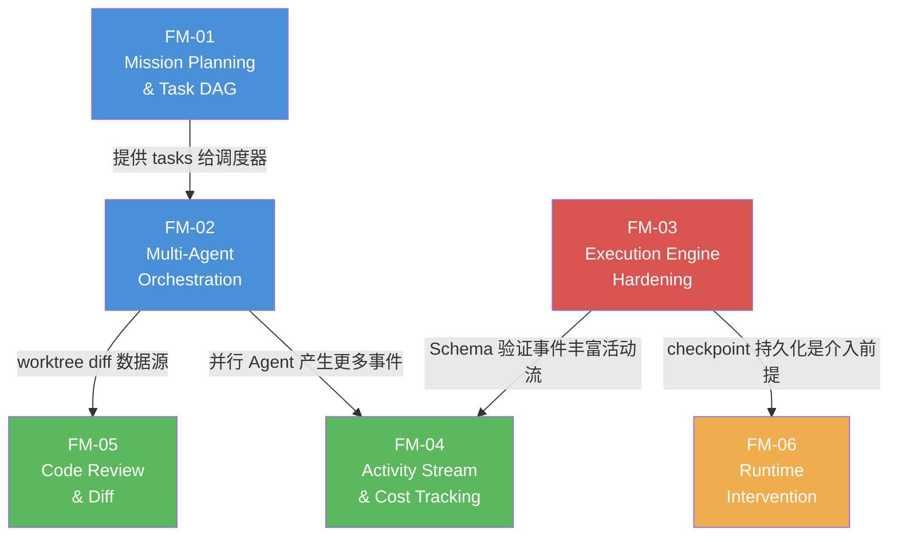

# Miragenty 功能模块总览

> 版本: v1.0 | 日期: 2026-04-01  
> 范围: Phase 1（核心循环验证）全部 9 项"必须有"功能  
> 基于: swarm-product-deep-dive.md + 001-foundation-phase0-2.md

---

## 一、模块划分原则

基于 Phase 1 的 9 项必须功能，按**内聚性**和**依赖关系**划分为 6 个功能模块：

| 模块 ID | 名称 | 覆盖 Phase 1 项 | 核心职责 |
|---------|------|:---:|------|
| FM-01 | Mission Planning & Task DAG | #1, #9 | 用户输入需求 → Planner 分解任务 → DAG 展示与编辑 |
| FM-02 | Multi-Agent Orchestration | #2 | Agent 调度器 + Git worktree 隔离 + 并行执行 |
| FM-03 | Execution Engine Hardening | #3, #4 | Checkpoint 持久化 + Schema 验证 + Agent 取消 |
| FM-04 | Activity Stream & Cost Tracking | #5, #7 | 活动流 UI 增强 + 实时成本追踪与展示 |
| FM-05 | Code Review & Diff | #6 | Monaco Editor 集成 + Worktree Diff 审查界面 |
| FM-06 | Runtime Intervention | #8 | 便签条注入 + Checkpoint 暂停/恢复机制 |
| FM-08 | Mission Lifecycle | — | 历史 Mission 删除 + 重新执行（全量/仅失败） |

---

## 二、模块依赖关系



依赖说明：
- **FM-01 → FM-02**：调度器需要 Planner 产出的 Task 列表和 DAG 作为输入
- **FM-02 → FM-04**：多 Agent 并行产生大量事件，活动流需要支持多 Agent 同时显示
- **FM-02 → FM-05**：Code Review 需要从 Agent 的 worktree 中获取 diff 数据
- **FM-03 → FM-06**：运行时介入依赖 checkpoint 持久化和暂停/恢复机制
- **FM-03 → FM-04**：Schema 验证结果需要在活动流中展示

---

## 三、开发优先级与排期

### 优先级矩阵

| 优先级 | 模块 | 理由 | 建议周期 |
|:---:|------|------|:---:|
| **P0** | FM-01 Mission Planning | 用户流程的入口，其他模块的前置依赖 | 5-7 天 |
| **P0** | FM-03 Execution Hardening | 引擎健壮性，FM-06 的前置依赖，且部分已完成 | 4-5 天 |
| **P1** | FM-02 Agent Orchestration | 核心差异化功能，依赖 FM-01 | 5-7 天 |
| **P1** | FM-04 Activity Stream | 用户可见度最高的改进，依赖 FM-02/FM-03 | 3-4 天 |
| **P2** | FM-05 Code Review | 重要但独立性高，可并行 | 5-7 天 |
| **P2** | FM-06 Runtime Intervention | 差异化功能，依赖 FM-03 | 4-5 天 |

### 建议开发顺序

```
Sprint 1 (Week 1-2):  FM-01 + FM-03 并行
                       ├─ FM-01: 对话面板 + Planner + DAG
                       └─ FM-03: Checkpoint + Schema + Cancel

Sprint 2 (Week 2-3):  FM-02 + FM-04 并行
                       ├─ FM-02: 调度器 + Worktree 集成
                       └─ FM-04: 活动流增强 + 成本 UI

Sprint 3 (Week 3-4):  FM-05 + FM-06 并行
                       ├─ FM-05: Monaco + Diff 审查
                       └─ FM-06: 便签条注入 + 暂停机制
```

---

## 四、基础设施现状（Phase 0-2 已完成）

每个模块可直接复用的基础设施：

| 基础能力 | 状态 | 位置 | 可复用模块 |
|---------|:---:|------|------|
| Agent 执行引擎（步进循环） | ✅ | `agent/engine.rs` | FM-02, FM-03, FM-06 |
| LLM Provider（Anthropic + OpenAI compat） | ✅ | `llm/` | FM-01, FM-02 |
| SQLite schema（missions, tasks, agents, events, costs） | ✅ | `db/migrations.rs` | 全部 |
| Git worktree 管理 | ✅ | `git/worktree.rs` | FM-02, FM-05 |
| 工具框架（5 个内置工具） | ✅ | `tools/` | FM-03 |
| Tauri IPC commands + events | ✅ | `commands/`, `src/ipc/` | 全部 |
| Zustand stores（ui, agent, task） | ✅ | `src/stores/` | 全部 |
| WorkspaceView（输入栏 + Agent 标签 + 活动流） | ✅ | `src/views/WorkspaceView.tsx` | FM-01, FM-04 |
| 设计系统（CSS 变量 + UI 组件） | ✅ | `src/styles/`, `src/components/ui/` | 全部 |

---

## 五、Schema 差异警告（跨模块）

当前 `db/migrations.rs` 中 001_initial 的状态枚举与需求文档不一致。**开发任何模块前必须先对齐 schema**。详见 FM-01 数据需求章节的差异表。

关键差异摘要：
- `missions.status`: 缺少 `draft`, `planned`；多余 `planning`, `executing`
- `tasks.status`: `queued` 应为 `ready`
- `tasks` 表缺少 `complexity` 字段
- `agents.status`: 缺少 `running`, `cancelled`

建议：首个开始的模块（FM-01 或 FM-03）在开发启动时一并处理迁移对齐。

---

## 六、技术债务优先清理项

以下技术债务需要在功能模块开发过程中同步解决：

| 债务 | 归属模块 | 解决时机 |
|------|---------|---------|
| Agent workspace 路径硬编码 (`/tmp/miragenty-workspace`) | FM-02 | 接入 worktree 时重构 |
| `stop_agent` 空实现 | FM-03 | 实现 CancellationToken |
| Checkpoint 未持久化到 SQLite | FM-03 | Checkpoint 持久化 |
| agent_events 表未写入 | FM-03 | 事件持久化 |
| 零测试覆盖 | 各模块 | 每模块附带 UT |

---

## 七、文档规范

每个功能模块包含两份文档：

### 6.1 需求文档 (`requirements.md`)

三层结构：

- **IR (Initial Requirements)**：用户故事、业务价值、验收标准（高层）
- **SR (Software Requirements)**：功能需求（FR-xxx）、非功能需求（NFR-xxx）、接口需求、数据需求
- **AR (Architecture Requirements)**：组件设计、接口契约（IPC/API）、数据模型变更、时序图、与其他模块的交互

### 6.2 测试用例文档 (`test-cases.md`)

- **单元测试（UT）**：每个 SR 功能需求对应的 Rust/TS 测试用例
- **集成测试（IT）**：前后端联调的端到端场景
- **边界测试（BT）**：异常输入、超时、并发冲突等边界条件
